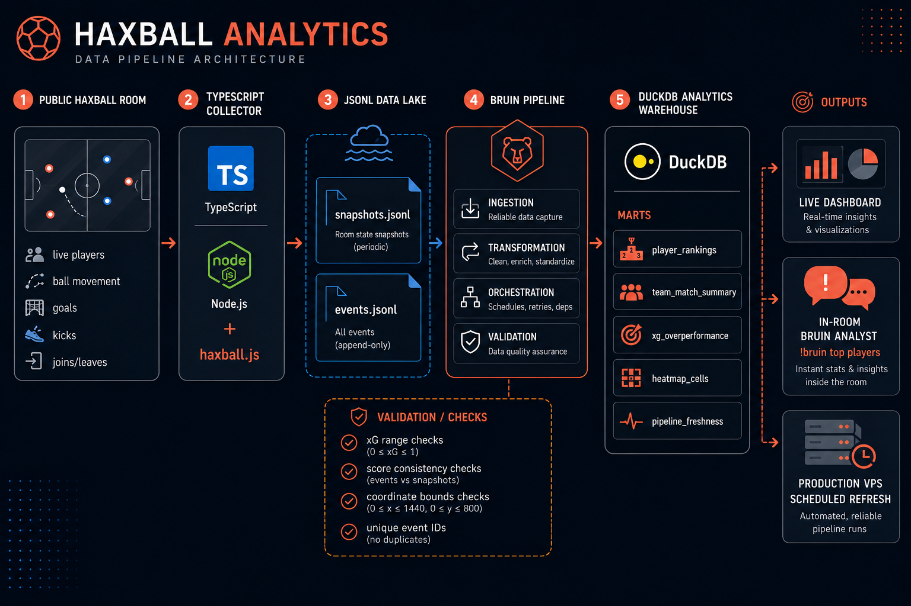
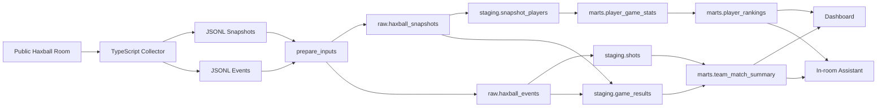
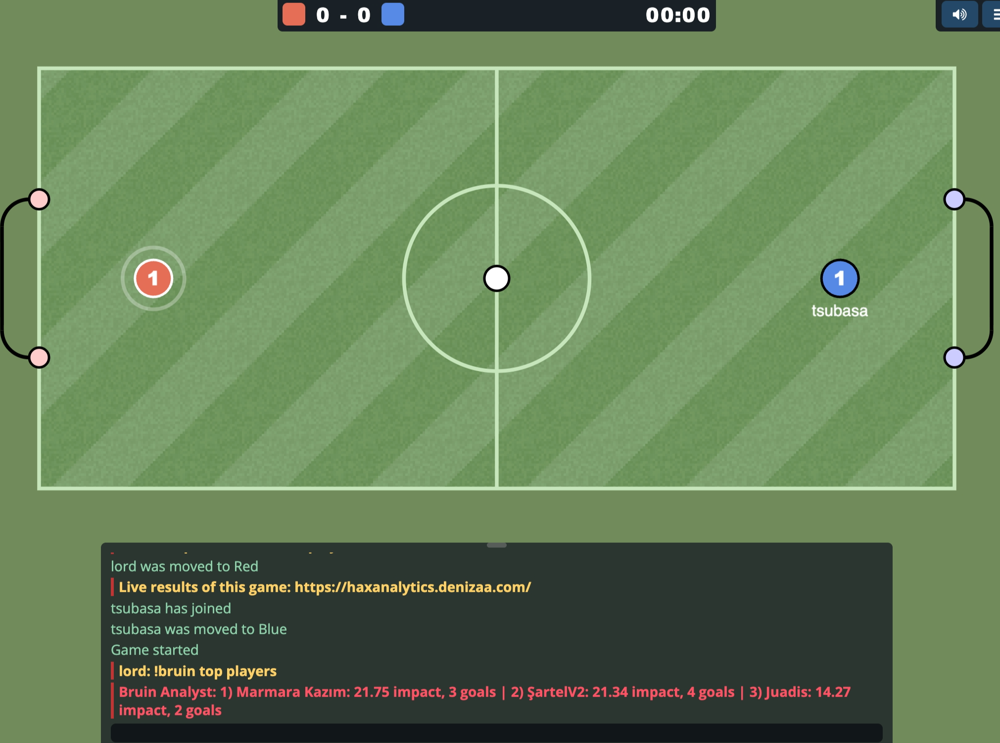
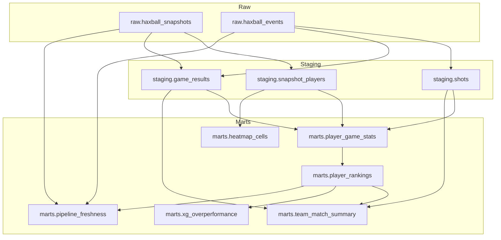
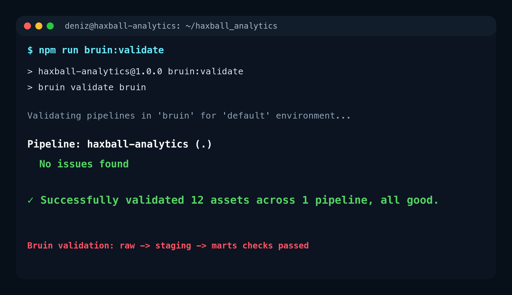

# Haxball Analytics

Real-time football intelligence for a live Haxball room.

[Live dashboard](https://haxanalytics.denizaa.com/) | [Bruin](https://getbruin.com/) | [Haxball](https://www.haxball.com/)

Haxball Analytics turns a public multiplayer Haxball room into a live sports analytics system. A Node.js collector captures every match, a data pipeline validates and models the raw telemetry, DuckDB stores the analytics marts, and a custom dashboard shows live tactics, player rankings, xG, lineups, finishing profiles, and pipeline health.

It also brings lightweight analytics answers into the game itself. Players can ask supported questions in Haxball chat and get safe, read-only answers from the same DuckDB marts that power the dashboard.


## Why It Exists

Most analytics demos begin with a finished CSV. This one creates the dataset live.

The room runs publicly, players join organically, and the project tracks the match like a small sports data platform:

- ball position, speed, score, clock, goals, kicks, joins, leaves, and player movement;
- xG estimates from shot location, angle, speed, direction, and goal probability;
- raw JSONL event streams that become trusted analytical tables;
- dashboard tabs for live command, player quality, match analytics, lineup analytics, finishing, and pipeline health;
- an in-room analytics assistant that answers supported questions from the same governed data layer.

## Analytics Pipeline

The project uses Bruin where it belongs: as the pipeline engine for the analytics lifecycle.

- **Ingestion**: live Haxball JSONL snapshots and event logs are loaded into DuckDB raw tables.
- **Transformation**: SQL assets build staging tables, shot detection, game results, player game stats, rankings, lineups, heatmaps, xG profiles, and freshness marts.
- **Orchestration**: scheduled runs refresh production analytics on the VPS.
- **Analysis**: dashboard views and in-room commands query curated marts.
- **Quality**: pipeline checks validate event IDs, accepted event types, team values, xG ranges, field coordinates, snapshot gaps, final-score consistency, and uniqueness constraints.



## Live Architecture



## What The Dashboard Shows

Dashboard tabs:

- **Live Command**: WebSocket-powered tactical map, score, xG, tempo, ball trail, and live room connection.
- **Player Quality**: all ranked players from `marts.player_rankings`.
- **Match Analytics**: recent match history with score, xG winner, favorites, and lineups.
- **Lineup Analytics**: roster strength, repeated lineups, and team combinations.
- **Finishing**: xG overperformance, finishing profile, shots, goals, and conversion.
- **Pipeline**: all-time production statistics and freshness metrics.

## In-Room Analytics Assistant

Players can query the analytics warehouse without leaving the room. The `!bruin` command maps supported football questions to predefined read-only SQL, runs them through the Bruin CLI against DuckDB, and returns a short answer in chat.

```text
!bruin who are the top players right now?
!bruin which player is most clinical against xG?
!bruin what happened in the latest match?
!bruin were there any xG upsets?
!bruin which lineup has performed best?
!bruin is the data pipeline fresh?
```

The command is intentionally safe. Player text is classified into predefined intents, each intent maps to hardcoded read-only SQL, and the query is executed against the DuckDB marts. Free-form SQL is not accepted from users.



## Data Model



## Data Assets

| Layer | Asset | Purpose |
| --- | --- | --- |
| Prepare | `haxball.prepare_inputs` | Chooses live data when available, otherwise sample data. Produces analytics-ready JSONL files. |
| Raw | `raw.haxball_snapshots` | Ingests position, score, ball, and player snapshots. |
| Raw | `raw.haxball_events` | Ingests goals, kicks, joins, leaves, game starts, and game stops. |
| Staging | `staging.snapshot_players` | Explodes player arrays into one row per player snapshot. |
| Staging | `staging.shots` | Detects meaningful attacking kicks and keeps xG features. |
| Staging | `staging.game_results` | Builds final score, winner, duration, event count, and player count per game. |
| Mart | `marts.player_game_stats` | Player-level match stats, minutes, xG, goals, shots, and result. |
| Mart | `marts.player_rankings` | All-time player rankings, impact score, win rate, conversion, and xG rates. |
| Mart | `marts.team_match_summary` | Match summary, rosters, lineup strength, score, shots, and xG winner. |
| Mart | `marts.xg_overperformance` | Finishing profiles and clinical-overperformance leaderboard. |
| Mart | `marts.heatmap_cells` | Team territory heatmap cells from player positions. |
| Mart | `marts.pipeline_freshness` | Pipeline health metrics shown in the dashboard. |

## Quality Checks

Data quality checks are part of the product contract, not an afterthought:

- event IDs are unique and non-null;
- game IDs and player names are present where required;
- event types are limited to expected Haxball events;
- xG values stay between `0` and `1`;
- team values stay in the Haxball team enum;
- ball and player coordinates remain inside expected stadium bounds;
- snapshot gaps stay near the collection interval;
- final score matches recorded goal events;
- mart keys such as `player_name` and `game_id` remain unique where needed.



## Production Behavior

The live VPS runs two loops:

- the Haxball room process writes snapshots/events and serves the real-time dashboard;
- a scheduled pipeline run refreshes DuckDB marts for dashboard history and chat analysis.

Solo play is treated as warm-up. If only one player is in the room, the system switches to a training stadium, pauses stat persistence, and tells players that at least two players are needed. This protects production stats from test data while still showing the solo player on the live tactical map.

## Security Notes

The in-room analytics assistant is designed to be safe for public chat:

- users cannot submit SQL directly;
- text is mapped to a small set of supported intents;
- every intent uses hardcoded `SELECT`/`WITH` SQL;
- mutation keywords such as `delete`, `drop`, `alter`, `insert`, and `update` are blocked;
- assistant queries are executed with `spawn()` args, not shell string interpolation;
- answers are rate-limited and time-limited.

## Quick Start

### 1. Install dependencies

```bash
npm install
python3 -m venv .venv
.venv/bin/python -m pip install -r requirements.txt
```

Install Bruin CLI if needed:

```bash
curl -LsSf https://getbruin.com/install/cli | sh
```

### 2. Configure the room

```bash
cp .env.example .env
```

Add a token from <https://www.haxball.com/headlesstoken>.

### 3. Build analytics from sample data

```bash
npm run bruin:validate
npm run bruin:run
```

### 4. Run the dashboard demo

```bash
npm run demo
```

Open <http://localhost:3000/live.html>.

### 5. Run the live room

```bash
npm run dev
```

## Deployment

The `deploy/` folder includes a helper for syncing the project to a VPS without overwriting production `.env`, data, logs, `node_modules`, or build output.

```bash
export HAXBALL_VPS_HOST="user@server-ip-or-host"
export HAXBALL_VPS_PATH="/path/to/haxball_analytics"
export HAXBALL_VPS_RESTART_COMMAND="pm2 restart haxball-analytics"
./deploy/update-live.sh
```

## Tech Stack

- TypeScript, Node.js, Express, WebSocket
- Haxball Headless via `haxball.js`
- Bruin CLI for ingestion, transformations, orchestration, validation, and analysis
- DuckDB for the analytical warehouse
- Vanilla HTML/CSS/JS dashboard
- PM2 and cron on VPS production

## Visual Assets

README visuals live in `docs/images/`.
